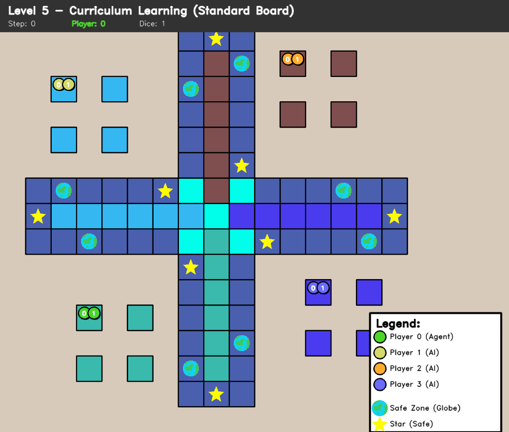

# GIF Generation Guide

This guide explains how to generate the animated GIF demo for the README.

## Prerequisites

Make sure you have installed all dependencies including imageio:

```bash
pip install -r requirements.txt
```

## Generating the Demo GIF

### Quick Start (Recommended)

Generate a GIF with default settings (1 episode, 250 steps, 10 fps):

```bash
python experiments/generate_demo_gif.py
```

This will create `assets/demo_gameplay.gif` which is displayed in the README.

### Custom Options

```bash
python experiments/generate_demo_gif.py \
  --checkpoint checkpoints/level5/best_model_ep014000_wr0.610_20251208_195012.pth \
  --output assets/demo_gameplay.gif \
  --episodes 1 \
  --max_steps 250 \
  --fps 10 \
  --resize 0.7
```

**Parameters:**
- `--checkpoint`: Path to trained model (default: best Level 5 model)
- `--output`: Output GIF path (default: `assets/demo_gameplay.gif`)
- `--episodes`: Number of game episodes to record (default: 1)
- `--max_steps`: Maximum steps per episode (default: 250)
  - Lower = shorter GIF, smaller file size
  - Higher = longer gameplay, larger file size
- `--fps`: Frames per second (default: 10)
  - Lower = slower playback, larger file
  - Higher = faster playback, smaller file
- `--resize`: Resize factor for output frames (default: 0.7)
  - 0.5 = half size (smaller file)
  - 1.0 = full size (larger file)

## File Size Optimization

### For README Display (Recommended)
```bash
python experiments/generate_demo_gif.py \
  --episodes 1 \
  --max_steps 200 \
  --fps 12 \
  --resize 0.6
```
Expected size: ~5-10 MB

### High Quality Demo
```bash
python experiments/generate_demo_gif.py \
  --episodes 1 \
  --max_steps 300 \
  --fps 15 \
  --resize 0.8
```
Expected size: ~15-25 MB

### Presentation/Website
```bash
python experiments/generate_demo_gif.py \
  --episodes 2 \
  --max_steps 150 \
  --fps 10 \
  --resize 0.5
```
Expected size: ~8-12 MB

## What Gets Recorded

The GIF captures:
- Full 4-player Ludo board visualization
- Agent (Player 0 - Blue) vs 3 Random opponents
- Token movements in real-time
- Dice rolls
- Captures and strategic plays
- Game outcome

## Troubleshooting

### ImportError: No module named 'imageio'
```bash
pip install imageio
```

### Checkpoint not found
The script will use a random agent if the checkpoint doesn't exist. Make sure you have trained a Level 5 model first:
```bash
python experiments/level5_train.py --episodes 15000
```

### GIF file too large
Reduce file size by:
1. Lowering `--max_steps` (shorter gameplay)
2. Lowering `--resize` factor (smaller dimensions)
3. Increasing `--fps` (fewer frames)
4. Recording fewer `--episodes`

### GIF playback too fast/slow
Adjust `--fps`:
- Lower FPS = slower playback
- Higher FPS = faster playback
- Recommended: 8-12 for smooth but clear gameplay

## Technical Details

### How It Works
1. Loads trained DQN agent
2. Runs game episodes
3. Captures frames from the CV2 board visualizer
4. Resizes frames for optimal file size
5. Combines frames into animated GIF using imageio

### Frame Processing
- Original board: 800x800 pixels
- With resize=0.7: 560x560 pixels
- Typical episode: 150-300 frames
- Total GIF: 150-300 frames + pause frames

### Output Quality
- Format: GIF (animated)
- Color depth: 24-bit RGB
- Loop: Infinite
- Compression: imageio default (optimized)

## Using in README

The generated GIF is automatically referenced in README.md:

```markdown
<p align="center">
  
</p>
```

## Git Tracking

The `.gitignore` is configured to:
- ✅ Track `assets/demo_gameplay.gif` (for README display)
- ❌ Ignore other video formats (*.mp4, *.avi)
- ❌ Ignore temporary assets (temp_*)

When you commit:
```bash
git add assets/demo_gameplay.gif
git commit -m "Add gameplay demo GIF"
```

## Advanced: Creating Multiple Versions

Create different versions for different purposes:

```bash
# Short teaser (for social media)
python experiments/generate_demo_gif.py \
  --output assets/demo_teaser.gif \
  --max_steps 100 \
  --fps 15 \
  --resize 0.5

# Full gameplay (for documentation)
python experiments/generate_demo_gif.py \
  --output assets/demo_full.gif \
  --max_steps 400 \
  --fps 10 \
  --resize 0.8

# Multiple episodes (for variety)
python experiments/generate_demo_gif.py \
  --output assets/demo_multi.gif \
  --episodes 3 \
  --max_steps 150 \
  --fps 12 \
  --resize 0.6
```

## Performance Notes

Generation time depends on:
- Number of episodes
- Max steps per episode
- System performance

Typical generation time:
- 1 episode, 200 steps: ~30-60 seconds
- 2 episodes, 300 steps: ~2-3 minutes

## Questions?

See `experiments/generate_demo_gif.py` for the full implementation details.
